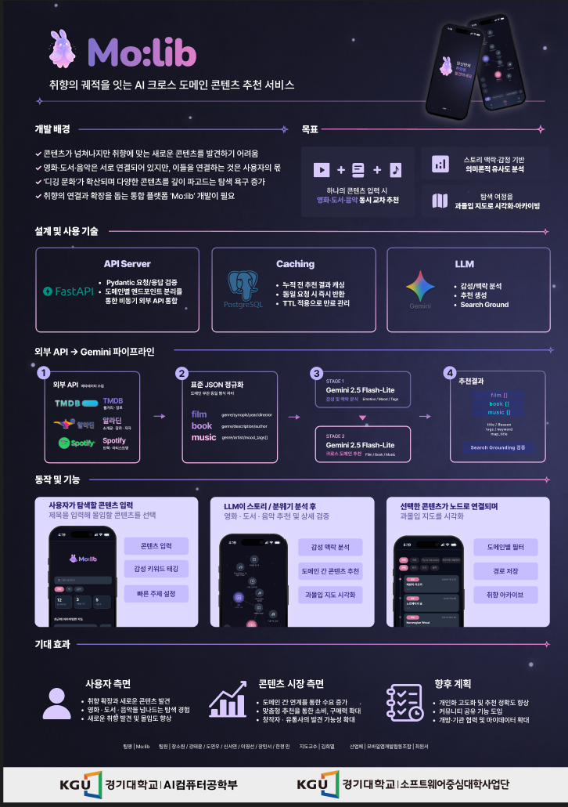

# Mo:lib 🎬📚🎵

> LLM 기반 감성·맥락 분석을 활용한 **영화 · 도서 · 음악 크로스 도메인 추천 서비스**
> 취향에 맞는 새 콘텐츠를 찾기 어렵다는 문제에서 출발해, 하나의 입력으로 세 도메인을 동시에 교차 추천합니다.

> ⚠️ 이 저장소는 팀 저장소([Jsowon/Mo-lib](https://github.com/Jsowon/Mo-lib))의 fork이며,
> 아래에 **제 기여(백엔드 · 인프라)** 를 중심으로 정리했습니다.

## 서비스 개요

외부 콘텐츠 API(TMDB · 알라딘 · Spotify)의 응답을 표준 JSON으로 정규화한 뒤,
Gemini 2-stage 파이프라인(감성/맥락 분석 → 도메인별 추천)으로 영화·도서·음악을 교차 추천합니다.

- **팀 프로젝트** (경기대 AI컴퓨터공학부 · 소프트웨어중심대학사업단)
- **내 역할**: 백엔드 & 인프라 — 팀 내 기여 2위 (49 commits)

## 내 기여 (Backend & Infra)

- **백엔드 토대 구축** — 프로젝트 스캐폴딩, CI 파이프라인, JWT 인증
- **EC2 자동 배포(CD)** — GitHub Actions 기반 SSH 배포 파이프라인 구축
- **동기 → 비동기 마이그레이션** — 운영 500 에러의 원인이던 동기 쿼리를 AsyncSession 기반으로 전환
- **CI 보안 강화** — Gitleaks(시크릿 스캐닝) + pip-audit(의존성 취약점 감사) 적용

## 트러블슈팅

### ① 불완전한 LLM 응답이 캐시를 오염시킨 문제 (PR #86)

- **문제**: 음악에서 추천받으면 음악만 3개 나오는 식으로, 일부 도메인이 누락된 결과가 하루 종일 반복됨.
- **원인**: Gemini가 간헐적으로 일부 도메인이 빠진 응답을 반환하는데, 이 불완전 응답이 검증 없이 24시간 캐시에 저장됨. 프롬프트를 강화해도 비결정성은 남음.
- **해결**: 기대 도메인(movie·book·music)이 모두 채워진 응답만 캐시하도록 가드 추가. 불완전 응답은 사용자에게 반환하되 캐시는 건너뛰어 다음 요청에서 AI가 재시도하게 함.
- **배운 것**: LLM 출력은 신뢰 대상이 아니라 **검증 대상**이며, 캐시에는 검증을 통과한 것만 넣어야 한다.

### ② 동기 쿼리로 인한 운영 500 & asyncpg 호환 (PR #38 · #41 · #30)

- **문제**: `/users/me/stats` 등에서 동기 쿼리와 naive `datetime`이 비동기 스택과 충돌해 500 에러 발생.
- **해결**: 해당 API를 AsyncSession 기반으로 마이그레이션하고 `datetime`을 UTC 기준으로 통일해 asyncpg 호환 문제 제거. `db.query()`를 코드베이스에서 완전 제거.
- **배운 것**: FastAPI async 스택에서는 DB 세션과 시간 처리까지 비동기/UTC로 **일관**되게 가져가야 한다.

### ③ CD '거짓 성공(false green)' 차단 (PR #85)

- **문제**: `requirements.txt`가 UTF-16으로 커밋돼 이미지 빌드가 실패하는데도, 배포 스크립트에 `script_stop`이 없어 CD가 초록불로 표시됨 — 실패를 아무도 인지하지 못함.
- **해결**: 파일을 UTF-8로 재인코딩하고, CD에 `script_stop: true`(중간 실패 시 즉시 실패) + 타임아웃 + `--force-recreate`를 추가.
- **배운 것**: 초록불이 곧 성공은 아니다 — 파이프라인은 **실패를 실패로 보고**하도록 만들어야 신뢰할 수 있다.

## 전체 서비스 코드

프론트엔드 · AI 파이프라인을 포함한 전체 코드와 최신 개발 현황은 팀 저장소 [Jsowon/Mo-lib](https://github.com/Jsowon/Mo-lib)에서 확인할 수 있습니다.
